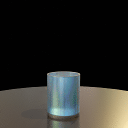
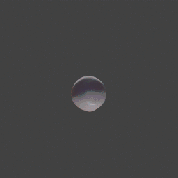

# Stop Motion OBJ
[Tutorial](https://github.com/neverhood311/Stop-motion-OBJ/wiki#quick-start) | [Forum](https://blenderartists.org/t/stop-motion-obj-obj-stl-ply-sequence-importer/670105) | [Documentation](https://github.com/neverhood311/Stop-motion-OBJ/wiki) | [How to Support](#how-to-support)

Stop Motion OBJ is a tool that lets you import a sequence of mesh files (.obj, .stl, .ply, .x3d, or .wrl), play them back in real time, then render them out to an animation. Each mesh may have a different vertex count, poly count, and even different UVs. This is especially useful for importing fluid simulations, for visualization of scientific data, and for rendering of 4D scan data.

Once a sequence is imported, you may perform many of the same operations on the sequence that you would on a single mesh. Many of the Object Modifiers work on the entire mesh sequence. Mesh sequences may be rendered in both Cycles and Eevee.

Stop Motion OBJ is able to import very complex mesh sequences that cannot fit in memory. Using [Streaming sequences](https://github.com/neverhood311/Stop-motion-OBJ/wiki#streaming), you can specify how many meshes to keep in memory at any given time and Stop Motion OBJ will automatically load and/or remove meshes so you don’t run out of memory.

# Gallery
| | | |
|:---:|:---:|:---:|
||||
|Lee Perry Smith \| [Infinite Realities](https://ir-ltd.net/) \| [AEONX](https://aeonx.com/)|Mike Brondbjerg \| [kultur.design](http://www.kultur.design/) \| [Twitter](https://twitter.com/mikebrondbjerg)|XC Engineering \| [XC Engineering](https://www.xceng.com/en/) \| [FLOW-3D](https://www.flow3d.com/)|
||||
||||
|Franklyn D'souza \| [Twitter](https://twitter.com/franklynd/status/1231625663095934977)|Justin Jensen \| [Fourveo](https://www.researchgate.net/publication/325426062_Fourveo_Integration_of_4D_Animation_into_Conventional_3D_Animation_Workflows) \| [YouTube](https://www.youtube.com/channel/UCHnTdtUrB1L_1Xyid8tyZPg)|Justin Jensen \| [Fourveo](https://www.researchgate.net/publication/325426062_Fourveo_Integration_of_4D_Animation_into_Conventional_3D_Animation_Workflows) \| [YouTube](https://www.youtube.com/channel/UCHnTdtUrB1L_1Xyid8tyZPg)|

# Download & Install
For Blender 2.92+, download the latest release [here](https://github.com/neverhood311/Stop-motion-OBJ/releases/latest). Make sure to download the file named Stop-motion-OBJ-v2.x.x.zip (don't download either of the “Source code” files).

To install, just follow the normal procedure for installing Blender addons. Open Blender and click Edit > Preferences... > Add-ons. Then click Install… and find the .zip file you previously downloaded. Once you’ve enabled the add-on, it should be ready to use immediately.

For Blender 2.91 and earlier, download [r2.1.1](https://github.com/neverhood311/Stop-motion-OBJ/releases/tag/v2.1.1)

For Blender 2.79 and earlier, download [r1.1.1](https://github.com/neverhood311/Stop-motion-OBJ/releases/tag/0.2.79.2). Note that this version is deprecated and will not be supported.

# Quick Start Tutorial

Importing a mesh sequence is easy:
1. Click File > Import > Mesh Sequence
1. Navigate to the folder where your mesh sequence is stored
1. Select your file type and adjust your import settings
1. In the File Name box, provide the first few letters of the name of one of your mesh files
1. Leave the Cache Mode set to Cached
1. Click Select Folder and wait while your sequence is loaded

Once it’s finished loading, you’re done!

# How to Support
Stop Motion OBJ wouldn’t be possible without your help. If you find this add-on helpful, please consider donating to support further development. Everything helps.

- [PayPal](https://www.paypal.com/justinj)
- [Ko-fi](https://ko-fi.com/stopmotionobj) (buy me a coffee)
- Bitcoin: 16Bbv5jmKJ2T3dqw2rbaiL6vsoZvyNvaU1
- Please use [#stopmotionobj](https://twitter.com/search?q=%23stopmotionobj&src=typed_query) when posting to social media
- Report bugs on the [issues](https://github.com/neverhood311/Stop-motion-OBJ/issues) page or on the [BlenderArtists thread](https://blenderartists.org/t/stop-motion-obj-obj-stl-ply-sequence-importer/670105)

# Acknowledgements
Special thanks to Stephen McAvoy for countless hours of testing, Lee Perry Smith and Mike Brondbjerg for generous donations, and Lee Perry Smith, Mike Brondbjerg, Franklyn D’Souza, and XC Engineering SRL for providing samples to showcase in the gallery. Finally, thanks to everyone who has suggested features, reported bugs, or donated to the project.
